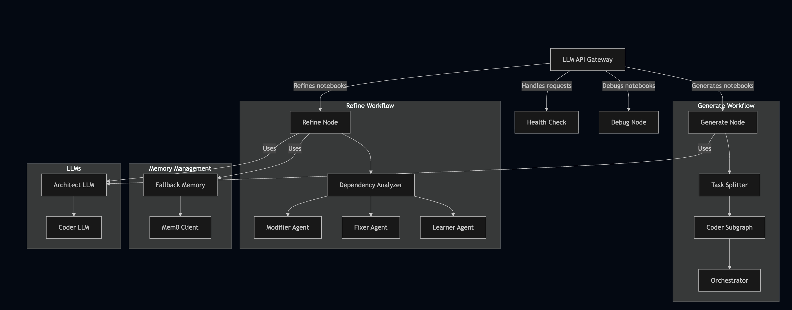

## Run it locally
1. Have your .env ready. A demo one is given in the .env.example 
2. Go to the root folder and then type
If on macOS/Linux
```
python3 -m venv <your-virtual-environment-name>
source <your-virtual-environment-name>/bin/activate
pip install -r requirements.txt
python -m uvicorn app.main:app --port 8000 --reload
```
## API and it's usage
**Base URL**: `http://localhost:8000` (or your deployed server address)

---

## 2. Structured 12-Cell Notebook Format
To ensure consistency and ease of editing, EvoLab decomposes a standard Python Evolutionary Algorithm script into exactly **12 cells** in a specific order:

1. `imports` - Packages (DEAP, NumPy, etc.)
2. `config` - Algorithm configuration constants
3. `creator` - DEAP creator setups (fitness and individual classes)
4. `evaluation` - Custom evaluation / fitness function
5. `crossover` - Genetic crossover operator registration/setup
6. `mutation` - Genetic mutation operator registration/setup
7. `selection` - Genetic selection operator registration/setup
8. `initialization` - Creating random individuals and populations
9. `toolbox` - Registering all components in the DEAP toolbox
10. `main_algorithm` - Core generational loop execution (`eaSimple`, `eaMuPlusLambda`, etc.)
11. `stats` - Code compiling statistics over generations
12. `visualization` - Code plotting objective value history graphs

---

## 3. API Reference (v1 Endpoints)

### A. Generation
#### `POST /v1/generate`
Generates a brand-new evolutionary algorithm notebook from a structured set of variables or a natural language description.

* **Request Payload**:
  ```json
  {
    "user_id": "student-uuid",
    "notebook_id": "session-uuid",
    "problemName": "Sphere Optimization",
    "goalDescription": "Minimize sum of squares of variables in continuous domain",
    "populationSize": "100",
    "numGenerations": "50"
  }
  ```
* **Response (200 OK)**:
  ```json
  {
    "notebook_id": "session-uuid",
    "notebook": {
      "cells": [
        { "cell_type": "code", "cell_name": "imports", "source": "import numpy as np..." },
        { "cell_type": "code", "cell_name": "config", "source": "POP_SIZE = 100..." }
        // ... (12 cells in total)
      ],
      "requirements": "deap\nnumpy\nmatplotlib"
    },
    "requirements": "deap\nnumpy\nmatplotlib",
    "message": "Notebook generated successfully"
  }
  ```

---

### B. Refinement
#### `POST /v1/sessions/{session_id}/modify`
Modifies an existing notebook code state based on conversational input (e.g. "Change the mutation to polynomial mutation").

* **Request Payload**:
  ```json
  {
    "user_id": "student-uuid",
    "notebook_id": "session-uuid",
    "instruction": "Use tournament selection with tournament size of 5",
    "notebook": {
      "cells": [
        { "cell_type": "code", "cell_name": "imports", "source": "..." }
        // ... (Current state of all 12 cells)
      ]
    }
  }
  ```
* **Response (200 OK)**:
  ```json
  {
    "notebook_id": "session-uuid",
    "notebook": {
      "cells": [ ... ] // Updated 12-cell list
    },
    "changes_made": [
      "Updated the selection operator configuration in the config cell and registered tournament selection with tournament size 5 in the toolbox cell."
    ],
    "cells_modified": [1, 8], // Indices of cells changed (0-indexed: config is 1, toolbox is 8)
    "requirements": "deap\nnumpy\nmatplotlib",
    "message": "Selection updated successfully"
  }
  ```

---

### C. Self-Healing Debugger
#### `POST /v1/sessions/{session_id}/fix`
Takes an execution runtime traceback error (from executing the notebook cells) and returns modified cells with corrections.

* **Request Payload**:
  ```json
  {
    "user_id": "student-uuid",
    "notebook_id": "session-uuid",
    "traceback": "NameError: name 'toolbox' is not defined",
    "notebook": {
      "cells": [ ... ] // Current state of all 12 cells
    }
  }
  ```
* **Response (200 OK)**:
  ```json
  {
    "notebook_id": "session-uuid",
    "notebook": {
      "cells": [ ... ] // Patched 12-cell list
    },
    "fixes_applied": [
      "Initialized and defined the DEAP toolbox object prior to registering operators."
    ],
    "validation_passed": true,
    "requirements": "deap\nnumpy\nmatplotlib",
    "message": "Notebook fixed successfully"
  }
  ```

---

### D. Version Control & History
#### `GET /v1/sessions/{session_id}`
Retrieves the complete historical version timeline for a session.

* **Response (200 OK)**:
  ```json
  {
    "session_id": "session-uuid",
    "versions": [
      {
        "version_number": 1,
        "operation_type": "generate",
        "prompt": "Solve continuous Sphere problem",
        "summary": "Initial generation",
        "is_active": false,
        "created_at": "2026-08-01T09:00:00Z"
      },
      {
        "version_number": 2,
        "operation_type": "refine",
        "prompt": "Use tournament selection",
        "summary": "Updated selection config and registered selectTournament",
        "is_active": true,
        "created_at": "2026-08-01T09:10:00Z"
      }
    ]
  }
  ```

#### `POST /v1/sessions/{session_id}/rollback`
Moves the pointer of the active version to a target version number.
* **Request Payload**:
  ```json
  {
    "version_number": 1
  }
  ```
* **Response (200 OK)**:
  ```json
  {
    "status": "success",
    "message": "Rolled back to version 1",
    "active_version": {
      "version_number": 1,
      "cells": {
        "imports": "...",
        "config": "..."
        // ... historical cells content
      }
    }
  }
  ```

---

## 4. Frontend Integration Guide

To connect a web interface (such as a Next.js or React application) to the EvoLab backend, follow this integration workflow.

### Step 1: Mapping the Editor to the 12-Cell Structure
Your frontend code editor should represent the notebook as **12 distinct, sequential code blocks** rather than a single massive script. This allows targeted editing and visual highlighting of changes.

1. Store an array of cells in the frontend state:
   ```typescript
   interface NotebookCell {
     cell_type: "code" | "markdown";
     cell_name: string; // "imports", "config", "creator", etc.
     source: string;
   }
   ```
2. Render these cells as 12 collapsible editors (using Monaco Editor, CodeMirror, or a similar library) stacked vertically in your layout.

---

### Step 2: Session Initialization & Generation
When a user launches a learning session or requests a new algorithm:
1. Generate a unique `session_id` (UUID v4) on the frontend.
2. Send a `POST` request to `http://localhost:8000/v1/generate`.
3. Capture the returned `notebook.cells` and populate your frontend cell states.
4. Render the `requirements` block inside a terminal/console component in the UI.

---

### Step 3: Interactive Chat Refinement
The frontend should feature an AI Tutor Chat Pane beside the code editor.
1. When the user types an instruction (e.g., *"Make it run for 100 generations"*):
   - Send the message along with your current 12-cell state to `/v1/sessions/{session_id}/modify`.
2. On receiving the response:
   - Replace the entire 12-cell state with the newly returned `notebook.cells`.
   - Print the `message` (tutor explanation) in the chat window.
   - Use the `cells_modified` array (an array of cell indices) to trigger a visual flash animation (e.g., a brief yellow background highlight) on the corresponding cells in the editor to show the user exactly where code was modified.

---

### Step 4: Code Execution & Self-Healing Debugging
If your frontend features a "Run Code" execution environment (like a Jupyter kernel, Pyodide, or a backend sandbox execution task):
1. Concatenate the 12 cells in order (from `imports` to `visualization`) to form a single execution script.
2. If execution fails, catch the **runtime traceback error**.
3. Send a `POST` request to `/v1/sessions/{session_id}/fix` containing the traceback and the current code cells.
4. If `validation_passed` is `true`:
   - Replace the cells in the editor with the new code state.
   - Show a success alert: *"Tutor successfully fixed the runtime error!"*.
5. If the self-healing step failed, display the original error traceback in your console output and prompt the user.

---

### Step 5: Version History Timeline
Implement a Git-style history drawer or sidebar:
1. Call `GET /v1/sessions/{session_id}` to retrieve the session timeline array.
2. Render a vertical timeline displaying each version's `version_number`, `operation_type`, `prompt`, `summary`, and the timestamp.
3. Highlight the version where `is_active` is `true`.
4. When a user clicks **"Rollback to this version"**:
   - Send a `POST` request to `/v1/sessions/{session_id}/rollback` with the target `version_number`.
   - Update the code editors with the code cells returned under `active_version.cells` (translating the flat dictionary back to your frontend cell array).
   - Re-fetch the timeline to refresh the active indicator.

---

## 5. Architecture Diagram

